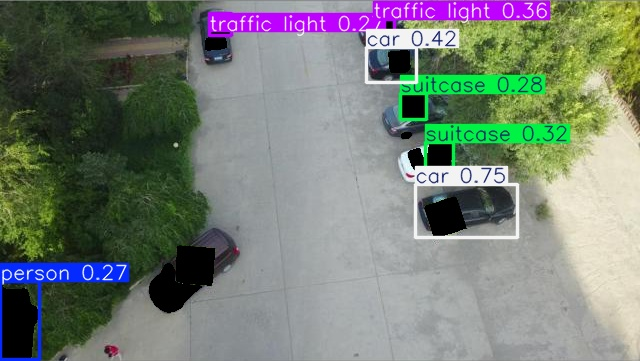
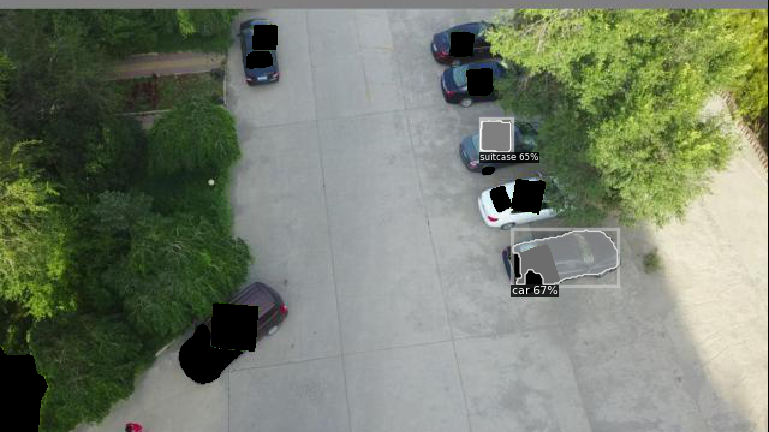
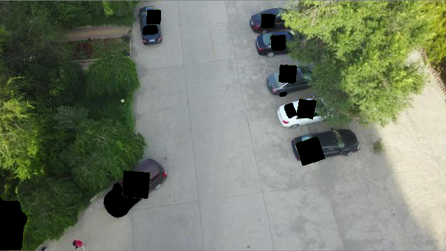
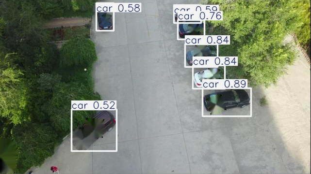
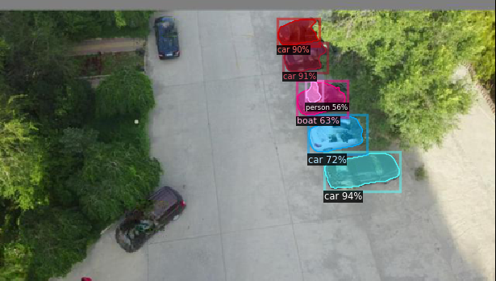
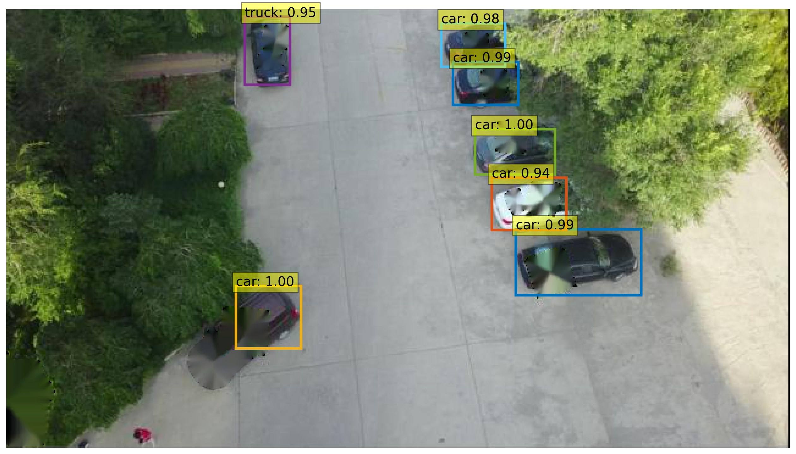

# Fast Segment Anything

[[`📕Paper`](https://www.mdpi.com/2313-433X/11/9/316)] [[`🤗HuggingFace Demo`](https://huggingface.co/spaces/An-619/FastSAM)] [[`Colab demo`](https://colab.research.google.com/drive/1oX14f6IneGGw612WgVlAiy91UHwFAvr9?usp=sharing)] [[`Replicate demo & API`](https://replicate.com/casia-iva-lab/fastsam)] [~~[`OpenXLab Demo`](https://openxlab.org.cn/apps/detail/zxair/FastSAM)~~] [[`Model Zoo`](#model-checkpoints)] [[`BibTeX`](#citing-sar)] [[`Video Demo`](https://youtu.be/yHNPyqazYYU)]


In this paper, we introduce **SAR**, a patch-agnostic defense scheme based on image preprocessing that does not require additional model training. By integration of the patch-agnostic detection frontend with an additional broken pixel restoration backend, **Segment and Recover (SAR)** is developed for the large-mask-covered object-hiding attack. Our approach breaks the limitation of the patch scale, shape, and location, accurately localizes the adversarial patch on the frontend, and restores the broken pixel on the backend. Our evaluations of the clean performance demonstrate that SAR is compatible with a variety of pretrained object detectors. Moreover, SAR exhibits notable resilience improvements over state-of-the-art methods evaluated in this paper. Our comprehensive evaluation studies involve diverse patch types, such as localized-noise, printable, visible, and adaptive adversarial patches.


|                    VisDrone Dataset Patch                    |                    Custom Dataset Patch                    |                    Custom Dataset Patch                    |
| :----------------------------------------------------------: | :--------------------------------------------------------: | :--------------------------------------------------------: |
|  |   |  |
| :----------------------------------------------------------: | :--------------------------------------------------------: | :--------------------------------------------------------: |
|  |  |  |

**🍇 Updates**
- **`2024/6/25`** The edge jaggies issue has been slightly improved [#231](https://github.com/CASIA-IVA-Lab/FastSAM/pull/231), and the strategy has also been synchronized to the ultralytics project[#13939](https://github.com/ultralytics/ultralytics/pull/13939),[#13912](https://github.com/ultralytics/ultralytics/pull/13912). The [huggingface demo](https://huggingface.co/spaces/An-619/FastSAM) is updated.
- **`2023/11/28`** Recommendation: [Semantic FastSAM](https://github.com/KBH00/Semantic-Fast-SAM), which add the semantic class labels to FastSAM. Thanks to [KBH00](https://github.com/KBH00/Semantic-Fast-SAM) for this valuable contribution.


## Installation

Clone the repository locally:

```shell
git clone 
```

Create the conda env. The code requires `python>=3.7`, as well as `pytorch>=1.7` and `torchvision>=0.8`. Please follow the instructions [here](https://pytorch.org/get-started/locally/) to install both PyTorch and TorchVision dependencies. Installing both PyTorch and TorchVision with CUDA support is strongly recommended.

```shell
conda create -n SAR python=3.9
conda activate SAR
```

Install the packages:

```shell
cd SAR
pip install -r requirements.txt
```


## <a name="GettingStarted"></a> Getting Started


First download a [model checkpoint](#model-checkpoints).

Then, you can run the scripts to try the everything mode and three prompt modes.

```shell
# Everything mode
python run-SAR.py 
```


## License

The model is licensed under the [Apache 2.0 license](LICENSE).

## Acknowledgement

- [Segment Anything](https://segment-anything.com/) provides the SA-1B dataset and the base codes.
- [YOLOv8](https://github.com/ultralytics/ultralytics) provides codes and pre-trained models.
- [YOLACT](https://arxiv.org/abs/2112.10003) provides powerful instance segmentation method.
- [Grounded-Segment-Anything](https://huggingface.co/spaces/yizhangliu/Grounded-Segment-Anything) provides a useful web demo template.
- [PAD](https://github.com/Lihua-Jing/PAD.git) provides a useful demo template.

## Contributors

Our project wouldn't be possible without the contributions of these amazing people! Thank you all for making this project better.


## Citing sar

If you find this project useful for your research, please consider citing the following BibTeX entry.

```
@article{gu2025segment,
  title={Segment and Recover: Defending Object Detectors Against Adversarial Patch Attacks},
  author={Gu, Haotian and Jafarnejadsani, Hamidreza},
  journal={Journal of Imaging},
  volume={11},
  number={9},
  pages={316},
  year={2025},
  publisher={MDPI}
}
```

[](https://star-history.com/#CASIA-IVA-Lab/FastSAM&Date)

