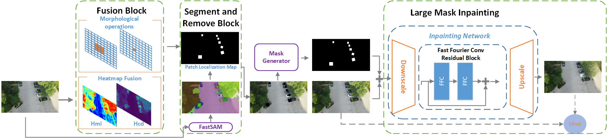

# Segment and Recover

[[`📕Paper`](https://www.mdpi.com/2313-433X/11/9/316)] [[`🤗HuggingFace Demo`]()] [[`Colab demo`]()] [[`Replicate demo & API`]()] [~~[`OpenXLab Demo`](https://openxlab.org.cn/apps/detail/zxair/FastSAM)~~] [[`Model Zoo`]()] [[`BibTeX`](#citing-sar)] [[`Video Demo`](https://youtu.be/yHNPyqazYYU)]


In this paper, we introduce **SAR**, a patch-agnostic defense scheme based on image preprocessing that does not require additional model training. By integration of the patch-agnostic detection frontend with an additional broken pixel restoration backend, **Segment and Recover (SAR)** is developed for the large-mask-covered object-hiding attack. Our approach breaks the limitation of the patch scale, shape, and location, accurately localizes the adversarial patch on the frontend, and restores the broken pixel on the backend. Our evaluations of the clean performance demonstrate that SAR is compatible with a variety of pretrained object detectors. Moreover, SAR exhibits notable resilience improvements over state-of-the-art methods evaluated in this paper. Our comprehensive evaluation studies involve diverse patch types, such as localized-noise, printable, visible, and adaptive adversarial patches.




**🍇 Updates** 

- **`2024/6/25`**: Code for real-time adversarial patch defender Segment and Recover (SAR) is available now! Check this [repo]() for more details.
- **`2023/11/28`**: Robust Object Detection Under Adversarial Patch Attacks in Vision-Based Navigation is available. Check this [repo]() for more details.

__Authors__: [Haotian Gu](), [Hamid Jafarnejad Sani](https://www.stevens.edu/profile/hjafarne) from the [SIT Safe Autonomous System Lab](https://saslabstevens.github.io/).


## Installation

Clone the repository locally:

```shell
git clone https://github.com/robotics-dotcom/SAR.git
```

Create the conda env. The code requires `python>=3.7`, as well as `pytorch>=1.7` and `torchvision>=0.8`. Please follow the instructions [here](https://pytorch.org/get-started/locally/) to install both PyTorch and TorchVision dependencies. Installing both PyTorch and TorchVision with CUDA support is strongly recommended.

```shell
conda create -n SAR python=3.9
conda activate SAR
```

Install the packages:

```shell
cd SAR
pip install -r requirements.txt
```


## <a name="GettingStarted"></a> Getting Started


First download a [model checkpoint](#model-checkpoints).

Then, you can run the scripts to try the everything mode and three prompt modes.

```shell
# Everything mode
python run-SAR.py 
```
## Results

All result were tested on a single NVIDIA GeForce RTX 3090.

### 1. Inference comparsion of PAD and SAR
|       |                    YOLOv11                                        |                    Faster RCNN                               |                               DETR                             |
|:----: | :---------------------------------------------------------------: | :----------------------------------------------------------: | :------------------------------------------------------------: |
|PAD|   |  |  |
|SAR|  |    | |
## License

The model is licensed under the [Apache 2.0 license](LICENSE).

## Acknowledgement

- [Segment Anything](https://segment-anything.com/) provides the SA-1B dataset and the base codes.
- [YOLOv8](https://github.com/ultralytics/ultralytics) provides codes and pre-trained models.
- [YOLACT](https://arxiv.org/abs/2112.10003) provides powerful instance segmentation method.
- [Grounded-Segment-Anything](https://huggingface.co/spaces/yizhangliu/Grounded-Segment-Anything) provides a useful web demo template.
- [PAD](https://github.com/Lihua-Jing/PAD.git) provides a useful demo template.

## Contributors

Our project wouldn't be possible without the contributions of these amazing people! Thank you all for making this project better.


## Citing sar

If you find this project useful for your research, please consider citing the following BibTeX entry.

```
@article{gu2025segment,
  title={Segment and Recover: Defending Object Detectors Against Adversarial Patch Attacks},
  author={Gu, Haotian and Jafarnejadsani, Hamidreza},
  journal={Journal of Imaging},
  volume={11},
  number={9},
  pages={316},
  year={2025},
  publisher={MDPI}
}
```


